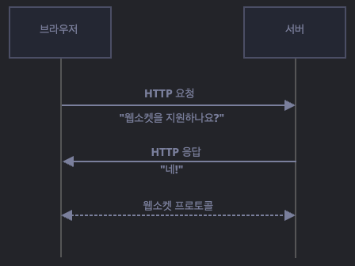

# Chat App

## Spec
- MongoDB
- Express
- ReactJS
- NodeJS
- WebSocket

### 📂 MongoDB https://www.mongodb.com
- 크로스 플랫폼 [도큐멘트 지향 데이터베이스](https://aws.amazon.com/ko/nosql/document/) 시스템. [NoSQL 데이터베이스](https://aws.amazon.com/ko/nosql/).
- Collection 안에 Document 들이 있고 그 안에 JSON 형태로 데이터를 저장함.
- JSON 형태로 데이터가 자유롭게 들어감.(Key-Value)
- 중복데이터를 제거하지 않는다. 정규화 없이 쓰인다.
- 분산처리가 잘된다. 여러 DB 에서 사용가능. 그래서 일관성, 정확도가 떨어질 수 있다.
- SNS, 채팅, 게시판, 온라인 게임등에 유용하다.


### 🎛️ Node.js
- Chrome V8 javaScript 엔진으로 빌드 된 javaScript 런타임(특정 언어로 만든 프로그램을 실행할 수 있는 환경)
- javaScript 를 서버에서도 사용할 수 있게 만들 프로그램
- 내장 HTTP 서버 라이브러리를 포함하고 있어서, 아파치 등의 별도 소프트웨어 없이 동작가능.
- 플랫폼의 제약없이 실행 가능.
- javaScript 가 웹브라우저에서만 동작 하는 것에서 독립시켜서 터미널 환경에서 실행 가능하다.


#### 논 블로킹 I/O

#### 스레드 개념
- javaScript 는 코드가 동시에 실행될 수 없는 싱글스레드 기반이다.
- **프로세스** : 운영체제에서 할당하는 작업단위. 노드나 웹브라우저는 개별적인 프로세스. 프로세스 간에는 메모리 등의 자원을 공유안함.
- **스레드** : 스레드는 프로세스 내에서 실행되는 흐름의 단위. 프로세스는 스레드를 여러개 생성해서 작업을 동시에 처리할 수 있다. 
- 스레드들은 부모 프로세스의 자원을 공유한다. 같은 주소의 메모리에 접근 가능하며 데이터를 공유한다.
- Node.js 는 싱글스레드, 논 블로킹 모델로 싱글스레드가 혼자서 일을 처리하지만 요청 순서가 아닌 논 블로킹 방식으로 이전 작업이 완료되는걸 기다리지 않고 다음 작업을 수횅한다.
- [참고](https://hanamon.kr/nodejs-%EA%B0%9C%EB%85%90-%EC%9D%B4%ED%95%B4%ED%95%98%EA%B8%B0/)


### ⛓️ WebSocket
- wss:// 프로토콜을 이용하여 클라이언트와 서버간의 양방향 데이터 통신을 가능하게 해준다.
- 데이터는 패킷(Packet) 형태로 전달되면, Connection 이 이뤄지면 클라이언트에서 추가로 HTTP 요청없이 양방향 통신이 가능하다.
```javascript
let socket = new WebSocket(url);

// Connection 이 정상적으로 이루어졌을때 발생
socket.onopen = function (e) {
  alert("[open] Connection 생성");
  socket.send("My name is jintae"); // 데이터 전송
};

// 데이터를 수신받을때 발생
socket.onmessage = function (event) {
  alert(`[message] 서버로부터 전송받은 데이터: ${event.data}`);
};

//
socket.onclose = function (event) {
  if (event.wasClean) {
    // code 1000
    alert(`[close] Connection 이 종료됨 (code=${event.code} reason=${event.reason}`)
  } else {
    // e.g. Killed Process, Network error
    // code 1006
    alert("[close] Connection Died!")
  }
};

//
socket.onerror = function (error) {
  alert("[error]")
}
```

### HandShaked
- new WebSocket(url) 로 소켓이 생성되면 Connection 이 되면서 서버에 웹소켓 지원여부를 HTTP header 로 요청한다.
- 이때 header 에는 클라이언트의 오리진 정보, 변경하려는 프로토콜 정보등이 담겨있다.
- 서버에서 Okay 응답이 오면 HTTP 통신이 wss:// 프로토콜로 통신을 시작한다.



```javascript
GET /chat
Host: javascript.info
Origin: https://javascript.info
Connection: Upgrade
Upgrade: websocket
Sec-WebSocket-Key: Iv8io/9s+lYFgZWcXczP8Q==
Sec-WebSocket-Version: 13
```
